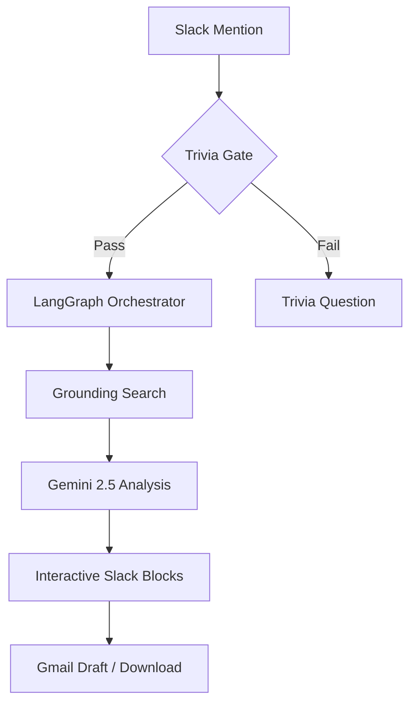

# 🔬 Adhoc Research Bot v2

A high-performance, agentic research assistant powered by **Gemini 2.5 Flash** and **LangGraph**. Designed for precision, speed, and seamless integration into professional workflows.

## 🌟 Key Features

*   **Gemini 2.5 Flash Integration**: Leverages the latest Gemini model for rapid, high-quality analysis.
*   **Google Search Grounding**: Strictly uses indexed web results (no hallucinations) for cited, verifiable findings.
*   **Per-User Gmail OAuth**: Users authenticate once; research is saved directly to **their own Gmail drafts** for review and sending.
*   **Interactive Trivia Gate**: Ensures users have a baseline understanding of AI/ML concepts before granting access.
*   **Multi-Format Export**: Save findings as Gmail drafts, Markdown files, or formatted documents.
*   **Fly.io Native**: Optimized for stable, scalable deployment on Fly.io.

---

## 🏗️ Architecture



## 🚀 Quick Deployment (Fly.io)

### 1. Secrets Configuration
Set the following secrets in your Fly.io dashboard:

| Secret | Description |
| :--- | :--- |
| `GEMINI_API_KEY` | Your Google AI Studio API key |
| `ANTHROPIC_API_KEY` | (Optional) Fallback Claude key |
| `SLACK_BOT_TOKEN` | Slack Bot User OAuth Token (`xoxb-...`) |
| `SLACK_APP_TOKEN` | Slack App-Level Token (`xapp-...`) |
| `GOOGLE_SERVICE_ACCOUNT_JSON` | Full JSON content of your Service Account |
| `GMAIL_CLIENT_ID` | Google OAuth Web Client ID |
| `GMAIL_CLIENT_SECRET` | Google OAuth Web Client Secret |
| `GMAIL_REDIRECT_URI` | `https://your-app.fly.dev/auth/gmail/callback` |

### 2. Deploy
```bash
flyctl deploy
```

---

## 📁 Project Structure

*   `src/research_agent.py`: Core LangGraph logic and state orchestration.
*   `src/research_tools.py`: Gemini + Google Search grounding tool.
*   `src/token_store.py`: Firestore-backed persistence for user OAuth tokens.
*   `run_slack.py`: Slack bot interface with Trivia Gate and Block Kit UI.
*   `api_server.py`: FastAPI server handling OAuth callbacks.
*   `entrypoint.sh`: Container startup script for Fly.io.

---

## 🔐 Security & Privacy

*   **No Data Retention**: Research is ephemeral; findings are sent to Slack or saved to the user's Gmail.
*   **OAuth Security**: The bot only requests `gmail.compose` scopes—it can create drafts but cannot read your existing emails.
*   **Firestore Encryption**: User tokens are stored securely in your Firebase project.

---

## 📝 License
MIT License - Developed for **AyaData AI Solutions**.